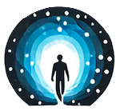

# Portal - A Space for Human Flourishing

 

## About Portal

Portal is a physical community space fostering human growth across three dimensions:

- **Think**: Make better maps of reality and improve our map-making
- **Feel**: Develop emotional resilience and forge deeper connections with self and others
- **Do**: Convert knowledge into meaningful change: tackle crucial problems and build towards a flourishing future

## Features

- 🏠 **Physical Spaces**
- Dedicated meditation & authentic relating room
- Workshop & seminar space
- Curated library
- Co-working community hall

- 📅 **Events**
- Regular meditation sessions
- Workshop series
- Reading groups
- Community discussions

- 🌟 **Activities across domains**
- Rationality & epistemology
- Emotional development & relating practices
- Productivity systems & impact strategy
- And more...

## Tech Stack

- Vue 3 with Composition API
- Vite for build tooling
- TailwindCSS for styling
- Vue Router for navigation
- Vue-Cal for event management
